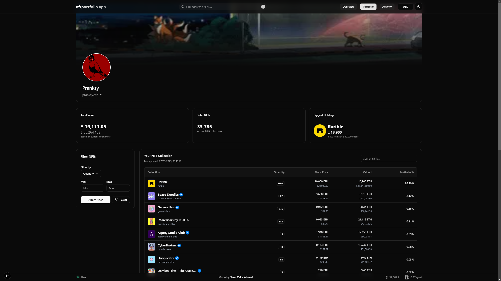
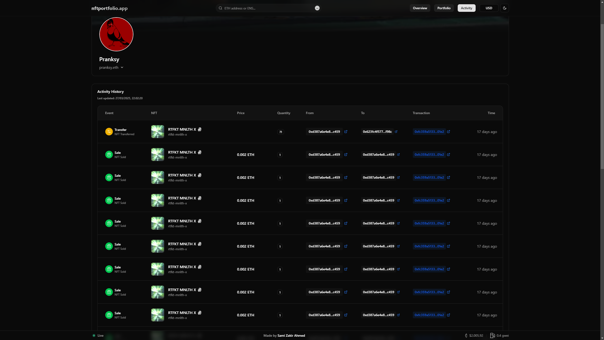

# NFT Portfolio Tracker

A comprehensive web application for tracking, analyzing, and visualizing your NFT portfolio across the Ethereum blockchain.

This project utilizes a dedicated backend service, available at: [`nft-backend-service`](https://github.com/samizak/nft-backend-service)

## Portfolio Page



## Activity Page



## ✨ Features

- **Portfolio Overview**: View all your NFTs in one place with real-time floor prices
- **Collection Analysis**: Analyze your NFT collections with detailed statistics and charts
- **Activity Tracking**: Monitor your NFT transactions and activity history
- **ENS Integration**: Support for Ethereum Name Service (ENS) domains
- **Real-time Data**: Live updates of NFT prices and portfolio value
- **MetaMask Integration**: Connect directly with your MetaMask wallet
- **Responsive Design**: Optimized for desktop, tablet, and mobile devices
- **Dark Mode**: Comfortable viewing experience in any lighting condition

## 🚀 Getting Started

This is a [Next.js](https://nextjs.org) project. To run it locally:

### Prerequisites

- Node.js (version 18 or higher)
- npm or yarn
- MongoDB instance
- Infura API key
- OpenSea API key

### Installation Steps

1.  **Clone the repository**

    ```bash
    git clone https://github.com/samizak/nftportfolio.app.git
    ```

2.  **Navigate to the project directory**

    ```bash
    cd nft-portfolio-tracker
    ```

3.  **Install dependencies**

    ```bash
    npm install
    ```

4.  **Run the development server**

    ```bash
    npm run dev
    ```

Open [http://localhost:3000](http://localhost:3000) with your browser to see the result.

You can start editing the page by modifying `app/page.tsx`. The page auto-updates as you edit the file.

---

## 🛠️ Technologies Used

- **Frontend**:

  - Next.js 15.2.0
  - React 19.0.0
  - TailwindCSS 4
  - shadcn/ui components

- **State Management & Data Fetching**:

  - TanStack React Query 5.67.2
  - SWR 2.3.2

- **Blockchain Integration**:

  - ethers.js 6.13.5 for Ethereum interactions
  - MetaMask wallet connection

- **Data Visualization**:

  - Recharts 2.15.1 for portfolio charts and analytics

- **UI/UX**:

  - Framer Motion 12.4.10 for animations
  - Lucide React 0.477.0 for icons
  - next-themes 0.4.4 for theme management
  - Sonner 2.0.1 for toast notifications

- **Database**:

  - MongoDB for data storage and caching

- **Development Tools**:
  - TypeScript for type safety
  - ESLint for code quality

## 📁 Project Structure

```
nft-portfolio-tracker/
├── app/                        # Next.js app directory
│   ├── activity/               # NFT activity tracking
│   ├── api/                    # API routes
│   │   ├── batch-collections/  # Collection data endpoints
│   │   ├── events/             # NFT events endpoints
│   │   ├── user/               # User data endpoints
│   │   └── ...                 # Other API endpoints
│   ├── overview/               # Portfolio overview
│   ├── portfolio/              # Portfolio details
│   └── ...                     # Other app pages
├── components/                 # Reusable UI components
│   ├── activity/               # Activity-related components
│   ├── landing-page/           # Landing page components
│   ├── ui/                     # UI components
│   └── ...                     # Other components
├── context/                    # React context providers
├── hooks/                      # Custom React hooks
├── lib/                        # Utility libraries
│   └── services/               # Service modules
├── public/                     # Static assets
├── types/                      # TypeScript type definitions
└── utils/                      # Helper utilities
```

## 🔐 Environment Variables

To run this project, you'll need to set up the following environment variables in a `.env.local` file:

### Required Variables:

- `MONGODB_URI`: Your MongoDB connection string
- `INFURA_API_KEY`: Infura API key for Ethereum data
- `OPENSEA_API_KEY`: OpenSea API key for NFT data
- `COINGECKO_API_KEY`: CoinGecko API key for cryptocurrency price data

⚠️ **Important**: Never commit your `.env.local` file to version control.

## 📊 Features in Detail

### Portfolio Tracking

- View all your NFTs in a single dashboard
- Real-time floor price updates from OpenSea
- Portfolio value calculation and historical trends

### NFT Activity

- Track purchases, sales, and transfers
- Historical transaction data
- Gas price information for transactions

### Collection Analysis

- Collection-specific statistics
- Floor price trends
- Rarity and trait analysis

### User Experience

- Fast, responsive interface
- Dark/light theme support
- Mobile-friendly design

## 🤝 Contributing

Contributions are welcome! Please feel free to submit a Pull Request.

## 📝 License

This project is licensed under the MIT License - see the LICENSE file for details.
